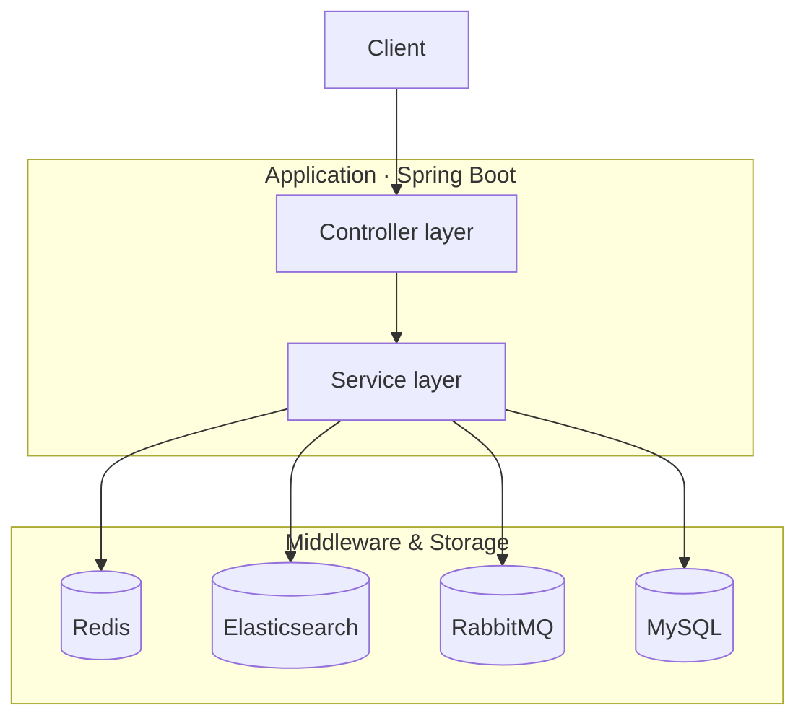

<div align="center">

# 🍜 UrbanPicks

**A high-concurrency local life service platform built with Spring Boot and Redis, focusing on cache optimization, distributed concurrency control and high-performance coupon flash-sale scenarios.**


**English** · [简体中文](README.zh-CN.md)

<sub>[Architecture](#architecture) · [Tech Stack](#stack) · [Features](#features) · [Highlights](#highlights) · [Requirements](#env) · [Getting Started](#start)</sub>

</div>

---

<a name="architecture"></a>

## 🏗 Architecture



The system is split into an application layer and a data layer. The Controller layer only receives and forwards requests; business logic sits in the Service layer, which holds no state of its own — everything is stored in the four components below:

- **Redis** — cache, distributed locks, flash-sale stock pre-deduction, user profile, GEO location index
- **MySQL** — the business data store; orders and merchants are persisted here
- **Elasticsearch** — the merchant full-text search index, synced from MySQL
- **RabbitMQ** — the flash-sale order buffer queue; requests are enqueued and orders created asynchronously

<a name="stack"></a>

## 🧰 Tech Stack

| Category | Technology |
| --- | --- |
| 🧩 Backend | Spring Boot 2.7, Spring MVC, MyBatis-Plus |
| ⚡ Cache | Redis (String, Hash, SortedSet, GEO, HyperLogLog, Lua scripts) |
| 🔒 Distributed & Concurrency | Redisson distributed lock, thread pool, asynchronous processing |
| 🔍 Search | Elasticsearch 7.x (RestHighLevelClient) |
| 📨 Message Queue | RabbitMQ |
| 🗄 Database | MySQL |
| 🛠 Tools | Lombok, Hutool, Jackson |

<a name="features"></a>

## ✨ Core Features

| Feature | Description |
| --- | --- |
| 🔐 User authentication | SMS verification codes, daily check-in with consecutive-day count |
| 🏪 Merchant query | Cached merchant detail, paging by category, GEO-based nearby search |
| 🎟 Coupon flash sale | Lua pre-deduction plus RabbitMQ async ordering, overselling prevented |
| 📝 Review community | Publish reviews, likes, hot ranking and followed-author feed |
| 👥 Social graph | Follow / unfollow, mutual-follow lookup |
| 🔎 Full-text search | Elasticsearch merchant search with highlighting and distance sorting |
| 🎯 Recommendation | Merchant and blog recommendation from a user behavior profile |

<a name="highlights"></a>

## 🔧 Technical Highlights

- **Flash-sale pipeline** — A Lua script atomically validates and pre-deducts stock, and the order is then created asynchronously through RabbitMQ. The publisher waits for the broker confirm and restores the Redis stock when confirmation fails; the consumer enforces one-order-per-user and idempotency with a Redisson lock plus a database unique index, moves messages that still fail after 3 retries into a dead-letter queue, and an order status endpoint is provided.
- **Search pipeline** — Elasticsearch full-text search with name and address highlighting and distance sorting; merchant create or update syncs incrementally, and a full rebuild endpoint is available; when ES is unavailable the query falls back to the database so the API stays up.
- **Personalized recommendation** — Five behaviour signals (view, search, like, follow, order) build a Redis ZSet user profile, scored as interest 0.40 / popularity 0.25 / distance 0.20 / rating 0.10 / freshness 0.05; results are written to a ZSet cache for reuse, with a popular-merchant fallback for anonymous users.
- **Cache penetration, breakdown and avalanche** — Null-value caching prevents penetration from repeated lookups of missing ids, a mutex rebuild prevents breakdown when a hot key expires and floods the database, and randomized TTLs keep large batches of keys from expiring at the same moment.
- **Nearby merchants** — Redis GEO radius search with paging, ordered by distance with the distance value attached; the GEO index is preheated at startup so queries are not empty on a cold start.

<a name="env"></a>

## 🌐 Environment Requirements

- JDK 8 or later
- MySQL 5.7 or later
- Redis 5.0 or later
- Elasticsearch 7.x (optional, disabled with `hm.es.enabled=false`)
- RabbitMQ (optional, `hm.mq.enabled=false` skips the queue and consumer beans, which also makes the seckill endpoint unavailable)
- Maven 3.6 or later

<a name="start"></a>

## 🚀 Getting Started

### 1. Initialize the database

`src/main/resources/db/aynm.sql` is a Navicat export holding the schema and seed data. It contains no `CREATE DATABASE` statement, so create the database first:

```bash
mysql -h 127.0.0.1 -u root -p -e "CREATE DATABASE IF NOT EXISTS hmdp DEFAULT CHARSET utf8mb4;"
mysql -h 127.0.0.1 -u root -p hmdp < src/main/resources/db/aynm.sql
```

Then run the index script (idempotent, safe to re-run):

```bash
mysql -h 127.0.0.1 -u root -p < sql/upgrade_recommend_search_mq.sql
```

It adds the unique index `uk_user_voucher` on `tb_voucher_order` (the MQ consumer's idempotency fallback) plus `idx_shop_type` on `tb_shop` and `idx_blog_user` / `idx_blog_shop` on `tb_blog` for the recommendation candidate queries.

### 2. Start the backing services

Required: MySQL 5.7+, Redis 5.0+

Optional: Elasticsearch 7.x, RabbitMQ

If Redis is not installed locally, Docker is the quickest way — keep the password consistent with the configuration file:

```bash
docker run -d --name redis -p 6379:6379 --restart unless-stopped \
  redis redis-server --requirepass <your-redis-password>
```

Leave the optional components disabled if you have not deployed them — the application still starts:

```yaml
hm:
  mq:
    enabled: false   # skips the queue and consumer beans; the seckill endpoint becomes unavailable
  es:
    enabled: false   # search falls back to database queries
```

### 3. Configure connections

Secrets such as passwords are kept out of the repository and supplied by `config/local.yaml`, which is ignored by `.gitignore`. Copy the template first:

```bash
cp config/local.yaml.example config/local.yaml
```

Then fill in the real values:

| Key | Purpose |
| --- | --- |
| `MYSQL_USERNAME` / `MYSQL_PASSWORD` | MySQL credentials |
| `REDIS_PASSWORD` | Redis password |
| `RABBITMQ_USERNAME` / `RABBITMQ_PASSWORD` | Required for flash-sale ordering |
| `ES_USERNAME` / `ES_PASSWORD` | Required for search |
| `SEARCH_ADMIN_KEY` | Header value guarding the index rebuild endpoint; when left blank the endpoint rejects every request |

The same keys can be supplied as environment variables instead, which take precedence.

Non-sensitive values such as connection addresses remain in `src/main/resources/application.yaml`, which references the keys above through `${...}` placeholders; the Redisson client reuses `spring.redis.*` and needs no separate configuration.

### 4. Start the application

```bash
# Package and run
mvn clean package -DskipTests
java -jar target/aynm-review-system-0.0.1-SNAPSHOT.jar

# Or run directly in development mode
mvn spring-boot:run
```

The service listens on port `8081` by default.

### 5. Verify the startup

```bash
curl http://localhost:8081/shop-type/list
```

A response containing `"success": true` and the shop-type list means the application is up (`/shop-type/**` is public and needs no login).

### 6. Enable the optional components

**Elasticsearch** — with ES running, rebuild the shop index:

```bash
curl -X POST http://localhost:8081/admin/search/shop/rebuild \
  -H "admin-key: dev-admin-key"
```

The default `admin-key` header value can be overridden via `hm.search.admin-key`.

**RabbitMQ** — start RabbitMQ to enable async seckill ordering (`hm.mq.enabled` defaults to `true`).
