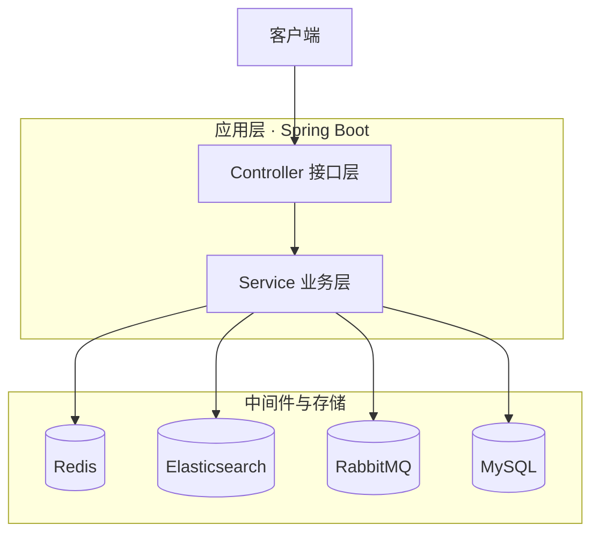

<div align="center">

# 🍜 UrbanPicks

**高并发本地生活服务平台，基于 Spring Boot + Redis，聚焦缓存优化、分布式并发控制与优惠券秒杀场景。**


[English](README.md) · **简体中文**

<sub>[系统架构](#architecture) · [技术栈](#stack) · [核心功能](#features) · [技术亮点](#highlights) · [环境要求](#env) · [快速开始](#start)</sub>

</div>

---

<a name="architecture"></a>

## 🏗 系统架构



系统分为应用层与数据层。Controller 层只接收和转发请求，业务逻辑集中在 Service 层；Service 层不保存数据，状态全部落在以下四个组件：

- **Redis** —— 缓存、分布式锁、秒杀库存预扣、用户画像、GEO 位置索引
- **MySQL** —— 业务数据主体，订单与商铺最终持久化于此
- **Elasticsearch** —— 商铺全文检索索引，由 MySQL 同步而来
- **RabbitMQ** —— 秒杀下单缓冲队列，请求入队后异步建单

<a name="stack"></a>

## 🧰 技术栈

| 分类 | 技术 |
| --- | --- |
| 🧩 后端 | Spring Boot 2.7, Spring MVC, MyBatis-Plus |
| ⚡ 缓存 | Redis（String, Hash, SortedSet, GEO, HyperLogLog, Lua 脚本） |
| 🔒 分布式与并发 | Redisson 分布式锁、线程池、异步处理 |
| 🔍 搜索 | Elasticsearch 7.x（RestHighLevelClient） |
| 📨 消息队列 | RabbitMQ |
| 🗄 数据库 | MySQL |
| 🛠 工具 | Lombok, Hutool, Jackson |

<a name="features"></a>

## ✨ 核心功能

| 功能 | 说明 |
| --- | --- |
| 🔐 用户登录 | 短信验证码登录、签到与连续签到统计 |
| 🏪 商铺查询 | 商铺详情缓存、按类型分页、附近商铺 GEO 检索 |
| 🎟 优惠券秒杀 | Lua 预扣 + RabbitMQ 异步下单，防超卖 |
| 📝 点评社区 | 发布点评、点赞、热门排行榜与关注流 |
| 👥 社交关系 | 关注/取关、共同关注 |
| 🔎 全文检索 | ES 商铺搜索，支持高亮与距离排序 |
| 🎯 个性化推荐 | 基于用户行为画像的商铺与博客推荐 |

<a name="highlights"></a>

## 🔧 技术亮点

- **秒杀链路** —— Lua 脚本原子完成库存校验与预扣，订单经 RabbitMQ 异步创建。生产者侧等待 Broker 确认，未确认时回补 Redis 库存；消费者侧用 Redisson 锁与数据库唯一索引做幂等，异常重试 3 次仍失败的消息转入死信队列，并提供订单状态查询接口。
- **搜索链路** —— Elasticsearch 全文检索，支持名称与地址高亮、按距离排序；商铺新增/更新时增量同步，另提供全量重建接口；ES 不可用时自动降级为数据库查询，接口不中断。
- **个性化推荐** —— 采集浏览、搜索、点赞、关注、下单五类行为构建 Redis ZSet 用户画像，按兴趣 0.40 / 热度 0.25 / 距离 0.20 / 评分 0.10 / 时效 0.05 加权打分，结果写入 ZSet 缓存复用，未登录时回退热门。
- **缓存穿透、击穿与雪崩** —— 空值缓存避免穿透（查询不存在的 id 反复打到数据库），互斥锁重建避免击穿（热点 key 失效瞬间大量请求压向数据库），写缓存时 TTL 附加随机抖动避免大批 key 同时过期。缓存重建另实现了逻辑过期方案，当前请求链路启用的是互斥锁。
- **缓存预热** —— 应用启动时把商铺坐标写入 Redis GEO 索引、按销量预热前 100 个热门商铺缓存；预热失败只记日志，不阻断启动。
- **分布式锁与原子扣减** —— Redisson 保证一人一单与幂等建单，秒杀库存通过 Lua 脚本在 Redis 上一次性完成校验与扣减。
- **附近商铺** —— 基于 Redis GEO 的半径检索与分页，按距离排序返回并携带距离值。

<a name="env"></a>

## 🌐 环境要求

- JDK 8 或以上
- MySQL 5.7 或以上
- Redis 5.0 或以上
- Elasticsearch 7.x（可选，`hm.es.enabled=false` 关闭）
- RabbitMQ（可选，`hm.mq.enabled=false` 时不注册队列与消费者，秒杀入口同时不可用）
- Maven 3.6 或以上

<a name="start"></a>

## 🚀 快速开始

### 1. 初始化数据库

`src/main/resources/db/aynm.sql` 为 Navicat 导出的表结构与初始数据，脚本内不含建库语句，需先建库再导入：

```bash
mysql -h 127.0.0.1 -u root -p -e "CREATE DATABASE IF NOT EXISTS hmdp DEFAULT CHARSET utf8mb4;"
mysql -h 127.0.0.1 -u root -p hmdp < src/main/resources/db/aynm.sql
```

随后执行索引补充脚本（幂等，可重复执行）：

```bash
mysql -h 127.0.0.1 -u root -p < sql/upgrade_recommend_search_mq.sql
```

该脚本创建 `tb_voucher_order` 的唯一索引 `uk_user_voucher`（MQ 消费者幂等兜底），以及 `tb_shop.idx_shop_type`、`tb_blog.idx_blog_user`、`tb_blog.idx_blog_shop` 供推荐候选查询使用。

### 2. 启动依赖服务

必需：MySQL 5.7+、Redis 5.0+

可选：Elasticsearch 7.x、RabbitMQ

本机未安装 Redis 时可用 Docker 快速启动，注意密码需与配置文件保持一致：

```bash
docker run -d --name redis -p 6379:6379 --restart unless-stopped \
  redis redis-server --requirepass <你的Redis密码>
```

未部署的可选组件保持关闭即可，不影响应用启动：

```yaml
hm:
  mq:
    enabled: false   # 关闭后不注册队列与消费者，秒杀入口不可用
  es:
    enabled: false   # 关闭后搜索自动降级为数据库查询
```

### 3. 配置连接信息

密码等敏感项不写在仓库里，由 `config/local.yaml` 提供（该文件已被 `.gitignore` 忽略）。先从模板复制一份：

```bash
cp config/local.yaml.example config/local.yaml
```

填入实际值：

| 配置项 | 用途 |
| --- | --- |
| `MYSQL_USERNAME` / `MYSQL_PASSWORD` | MySQL 账号密码 |
| `REDIS_PASSWORD` | Redis 密码 |
| `RABBITMQ_USERNAME` / `RABBITMQ_PASSWORD` | 启用秒杀时需要 |
| `ES_USERNAME` / `ES_PASSWORD` | 启用搜索时需要 |
| `SEARCH_ADMIN_KEY` | 索引重建接口的请求头校验值，留空则接口拒绝所有请求 |

这些键也可以改用同名环境变量提供，环境变量优先级更高。

连接地址等非敏感项仍在 `src/main/resources/application.yaml` 中维护，由该文件里的 `${...}` 占位符引用上述键；Redisson 客户端复用 `spring.redis.*`，无需单独配置。

### 4. 启动应用

```bash
# 打包运行
mvn clean package -DskipTests
java -jar target/aynm-review-system-0.0.1-SNAPSHOT.jar

# 或开发模式直接启动
mvn spring-boot:run
```

服务默认监听 `8081` 端口。

### 5. 验证启动

```bash
curl http://localhost:8081/shop-type/list
```

返回 `"success": true` 及商铺类型列表即启动成功（`/shop-type/**` 为免登录接口，可直接访问）。

### 6. 启用可选组件

**Elasticsearch** —— 启动 ES 后重建商铺索引：

```bash
curl -X POST http://localhost:8081/admin/search/shop/rebuild \
  -H "admin-key: dev-admin-key"
```

请求头 `admin-key` 的默认值可通过 `hm.search.admin-key` 覆盖。

**RabbitMQ** —— 启动 RabbitMQ 后即可启用秒杀异步下单（`hm.mq.enabled` 默认为 `true`）。
